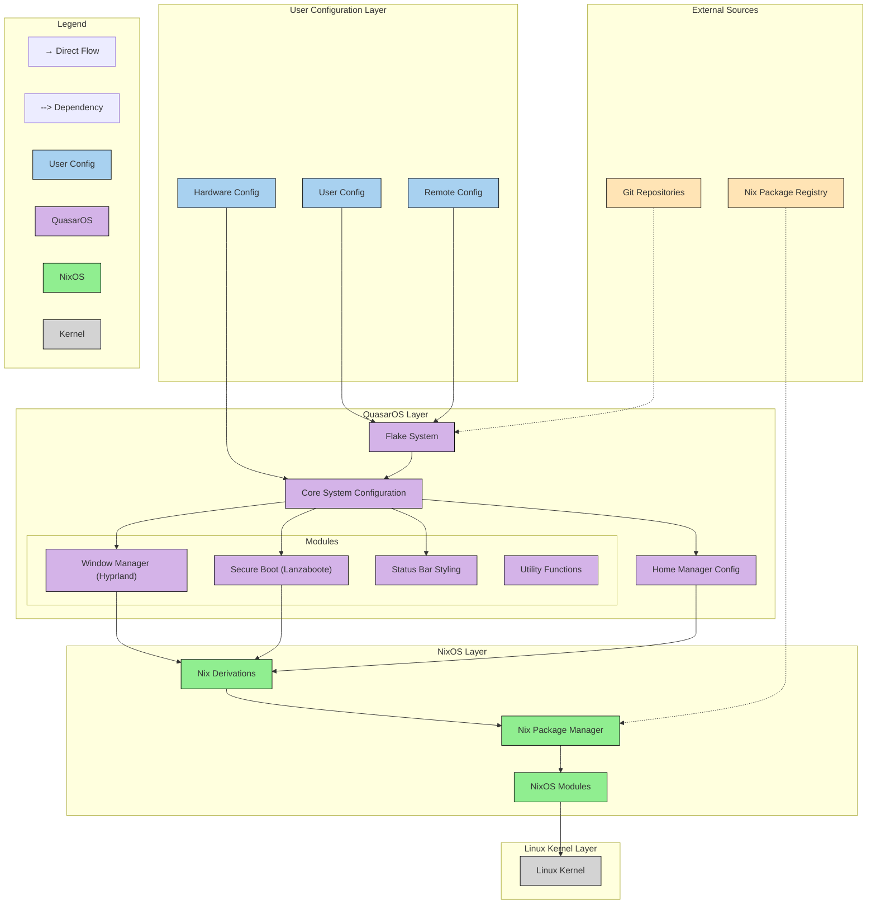

<!-- markdownlint-disable MD013 -->

# QuasarOS

```txt
/*****                                                 /******   /****
|*    |  |*   |    **     ****     **    *****        |*    |  /*    *
|*    |  |*   |   /* *   /*       /* *   |*   |      |*    |  |*
|*    |  |*   |  /*   *   ****   /*   *  |*   /     |*    |   ******
|*  * |  |*   |  ******       |  ******  *****     |*    |         |
|*   *   |*   |  |*   |   *   |  |*   |  |*  *    |*    |   *     |
 **** *   ****   |*   |    ****  |*   |  |*   *   ******    *****
```

My highly experimental Nix (and \*nix) based OS

## Technical Overview



Generated with [GitDiagram](https://gitdiagram.com/quantum9innovation/quasaros).

## Development

Most development happens on other branches (and there will likely be a lot of them at any given time). Take a look at some others for a sampling of the latest experiments. `main` can be considered (relatively) stable.

## About

As this repository is nowhere near a finished state, I would recommend subscribing to releases, so you can receive a GitHub notification when the first stable release is ready. You're probably wondering, however, what and perhaps *why* this is. Here's a little bit of context …

As part of my journey into the dangerous, mind-bending terrain of purely functional programming and hyper-abstract quasi-philosophical mathematical ideas (see e.g. [category theory](https://en.wikipedia.org/wiki/Category_theory) and [topos theory](https://en.wikipedia.org/wiki/Topos)), I discovered [NixOS](https://nixos.org/). What is NixOS?

Unlike traditional operating systems which rely on non-deterministic package management mechanisms compromised by a myriad of internal states, Nix takes a declarative approach to configuring the entire operating system. It is a Linux distribution that ships with its own package manager that installs packages in a deterministic way by building them in isolation using pure functions known as "derivations."

In NixOS, there is no state. The entire system is derived from a handful of configuration files, which build the system in its entirety. The same configuration can be deployed across multiple machines\[^1\] and you get identical systems.

As a Haskell addict, my brain was severely warped from the study of abstraction, and I began to examine some potential theories related to the abstraction of NixOS. You see, NixOS is really an abstraction on top of the Linux kernel. Unlike other distributions, which rely on internal state and therefore are not fully abstracted, NixOS specifies a language for building an operating system.

Taking this a bit further, we can abstract the Nix system configuration by creating a pure function ("derivation") that builds the standard configuration to build the system. Yes, we're talking about a derivation to build a derivation to build an operating system. At this point, if you have not been exposed to the pinnacle of abstraction that is category theory, you might want to stop reading.

This abstraction on top of NixOS allows for a custom Linux distribution to be built on top of NixOS. This distribution can ship with a series of default system configurations and packages, which can then be further customized by a user configuration, thereby further abstracting the already-abstracted NixOS configuration.

Of course, the choice of what those default system settings should be is highly personal. QuasarOS is a collection of my personal preferences that can be lightly tweaked through user configuration. This is possible because it exports not a system configuration but a morphism which transforms an object of type user configuration to an object of type system configuration\[^2\].

To reach the pinnacle of abstraction, you must complete one more step. Both QuasarOS and the user configuration must be deployed to remote version-controlled repositories, which can then be used as inputs to the Nix derivation that builds the system, allowing for your entire system to be configured from afar (via git). This leaves you with a dead-simple effective system configuration that lives on your local machine. This configuration merely pulls in the user configuration and feeds it into the QuasarOS system builder, also pulled over the network.

What this means in practice is that user-specific settings like the device hostname and other identifying details (user configuration) can be stored in a separate repository from the collection of default system settings (QuasarOS). Of course, this is a highly experimental and probably quixotic idea, which is precisely why I had to test it.

Oh, and did I mention that QuasarOS uses almost exclusively unstable packages? You're going to need to be ready to do a lot of generation backtracing if you want to daily drive this. Good luck!

\[^1\]: Assuming identical hardware; in reality, you need a special hardware configuration for each machine.

\[^2\]: It also allows for custom user configurations to be injected into the build process to take into account differences between e.g. hardware configuration across devices.
